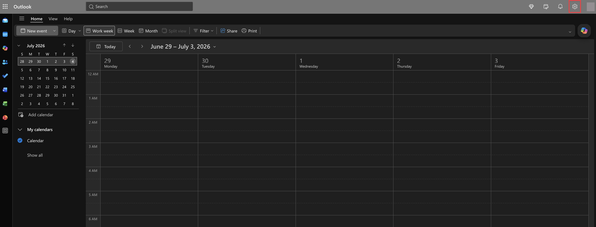
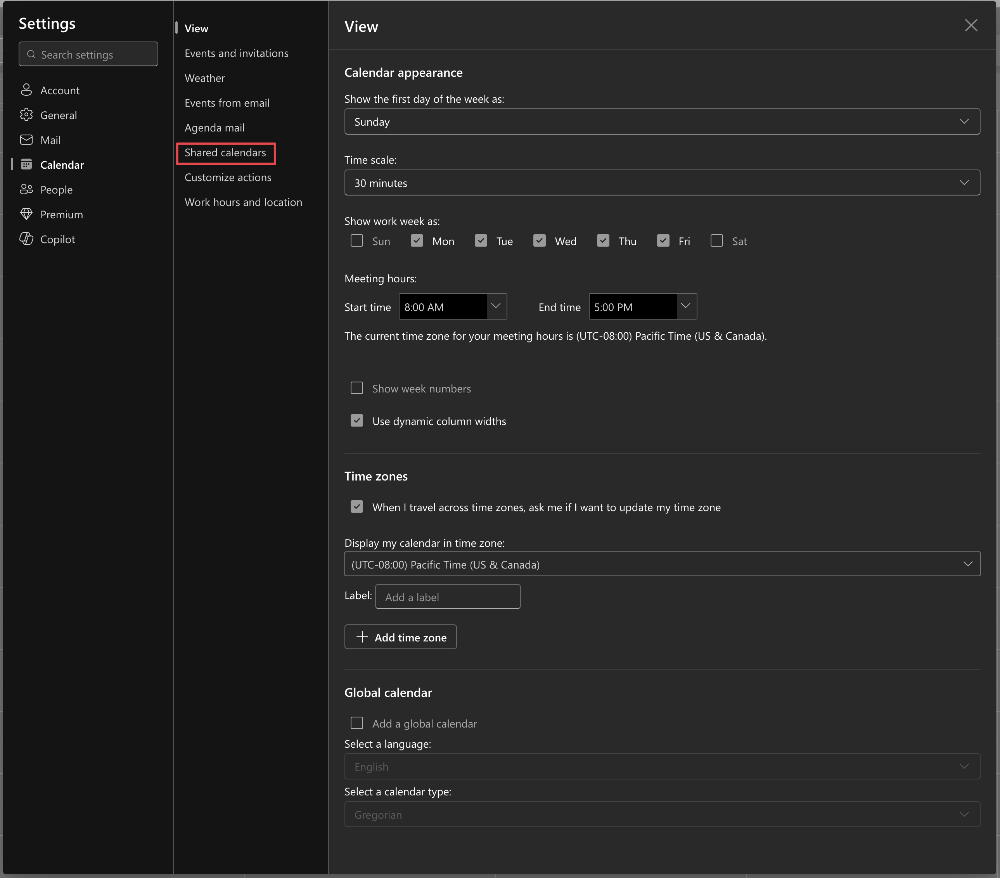
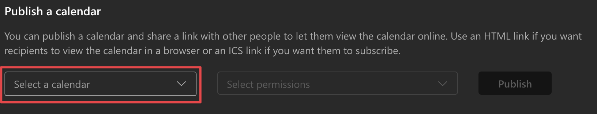
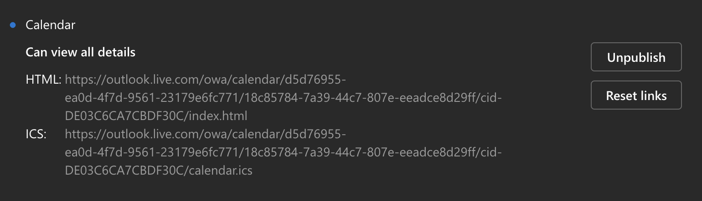

# Bookings Search

A Blazor Server app for searching and viewing [Microsoft Bookings](https://www.microsoft.com/microsoft-365/business/scheduling-and-booking-app) appointments. It reads a Bookings calendar from its published `.ics` feed, caches it in memory, and provides a fast searchable UI plus a day-timeline view.

### But... why?

Microsoft Bookings is good at *taking* appointments but not at *working with* them afterward. Its calendar view is fine for a glance, but there's no real search: when a customer calls and you only have their name, a phone number, or a ticket number, there's no fast way to find their appointment. Staff end up scrolling the calendar or hunting through Outlook, both of which take a lot of time.

This app closes that gap, and allows for instant search across every field Bookings records: customer, email, phone, service, notes, and ticket ID, so any detail finds the appointment.

The feedback I got from my team after having set this up is that it saved over **two hours** of work for them when reviewing our ticketing queue.

## Features

- **Search** appointments across customer name, email, phone, service, notes, ticket ID, and staff, with date-range, staff, status (upcoming/past), and sort filters.
- **Optional ticket links** render a per-appointment "Open ticket" button that deep-links into your ticketing system.

## How it works

A background service ([`IcsRefreshService`](Services/IcsRefreshService.cs)) fetches the configured ICS URL on an interval and parses it into an in-memory cache ([`IcsBookingsService`](Services/IcsBookingsService.cs)). Web requests are served from that cache, so only the very first request after a cold start waits on a fetch. When the feed is unreachable, the last good snapshot is served as stale data.

Microsoft Bookings encodes appointment details (customer, service, custom-field answers) into the ICS `SUMMARY`/`DESCRIPTION` fields; the parser extracts them, including an optional ticket ID from the first custom-field answer.

Please note that this is designed as a tool to be used *internally*, behind a corporate network/firewall, or placed behind authentication middleware. All visitors to the app will be able to see all appointment info.

## Requirements

- [.NET 10 SDK](https://dotnet.microsoft.com/download) (to build/run locally)
- A published Microsoft Bookings ICS calendar URL

### How to get an ICS URL

Microsoft Bookings, like any Outlook calendar, can publish a read-only ICS feed. To get the URL:

1. Open [Outlook on the web](https://outlook.office.com/calendar) and click the **Settings** (gear) icon in the top-right corner.

   

2. In the Settings dialog, go to **Calendar → Shared calendars**.

   

3. Under **Publish a calendar**, open the **Select a calendar** dropdown and pick the Bookings calendar you want to expose.

   

4. Set the permission to **Can view all details**, then click **Publish**. Full details are required so the feed includes customer info, notes, and custom fields.

   

5. Copy the **ICS** link (the one ending in `/calendar.ics`, not the HTML link) and use it as `Bookings:IcsUrl`.

   

> ⚠️ The ICS link embeds a secret token that grants read access to the calendar's full details. Treat it like a password.

### A note on custom fields and ticket IDs

Microsoft Bookings lets you attach **custom fields** to a service, which are extra questions a customer answers when booking. Bookings writes those answers into the calendar event, and the app surfaces them as appointment notes.

The answer to **Question 1** is treated specially: if it looks like a number (e.g. `123456` or `(No. 123456)`), the app interprets it as a **ticket ID** rather than a note. This app was originally built for a team that runs Bookings alongside a separate ticketing system, so each appointment can carry the ticket it relates to. Set [`Bookings:TicketUrlTemplate`](#configuration) and that ID becomes an **"Open ticket"** button that deep-links into your ticketing system; leave it blank and the ID is just shown inline.

The exact parsing lives in `NormalizeDescription` in [`IcsBookingsService`](Services/IcsBookingsService.cs) — adjust it there if your form uses a different convention.

## Configuration

Settings live in [`appsettings.json`](appsettings.json) and can be overridden with environment variables (double-underscore syntax, e.g. `Bookings__IcsUrl`).

| Key | Description | Default |
| --- | --- | --- |
| `Bookings:IcsUrl` | Published Microsoft Bookings ICS feed URL. **Required.** | — |
| `Bookings:BusinessId` | Bookings business email address (informational). | `bookings@example.com` |
| `Bookings:StaffEmailDomain` | Domain suffix used to distinguish staff from customer attendees. Blank treats all attendees as staff. | `""` |
| `Bookings:TicketUrlTemplate` | Ticket-system URL template with `{0}` as the ticket-ID placeholder, e.g. `https://tickets.example.com/Ticket?id={0}`. Blank hides the button. | `""` |
| `Bookings:RefreshIntervalSeconds` | How often to re-fetch the ICS feed. | `30` |
| `Webhook:ApiKey` | Shared secret required in the `X-Api-Key` header on the webhook endpoint. Blank disables the check. | `""` |

## Running locally

```bash
dotnet run
```

The app starts on the URL from [`Properties/launchSettings.json`](Properties/launchSettings.json) (`http://localhost:5159` by default). Set your ICS URL first, e.g.:

```bash
Bookings__IcsUrl="https://outlook.office365.com/owa/calendar/<your-calendar-id>/calendar.ics" dotnet run
```

## Deploying with Docker

A [`Dockerfile`](Dockerfile) and [`docker-compose.yml`](docker-compose.yml) are provided. Build and run:

```bash
docker compose up -d
```

The compose file publishes the app on port `5000`. Provide secrets and the ICS URL via `/etc/bookings-search/env` (an `env_file` of `KEY=VALUE` lines) or by editing the `environment:` block. Point your reverse proxy / access gateway at port 5000.

## API endpoints

| Method | Path | Description |
| --- | --- | --- |
| `GET` | `/api/export.csv` | Export appointments as CSV. Query params: `query`, `staffMemberId`, `dateFrom`, `dateTo`. |
| `POST` | `/api/webhook/booking-created` | Receive a booking notification (see below). |

## Webhook enrichment (optional)

The ICS feed does not include Microsoft 365 user IDs for staff. To associate them, `POST` a booking notification to `/api/webhook/booking-created`.

- Include the shared secret in the `X-Api-Key` header if `Webhook:ApiKey` is set.
- The body must contain `parameters.NotificationDefinition/notificationText`, whose text is parsed for the booking ID and staff members (display name, email, M365 ID). See [`NotificationParser`](Services/NotificationParser.cs).

## Project structure

```
Components/      Blazor pages, layout, and shared components
Models/          View models and DTOs
Services/        ICS fetching/parsing, background refresh, webhook store
Program.cs       App startup, middleware, and minimal-API endpoints
```
